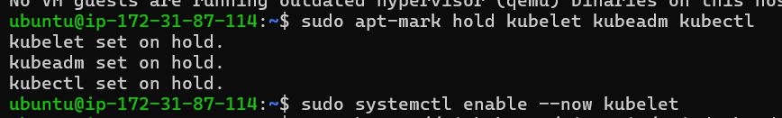

# Kubernetes
## Creating a K8s cluser by installing Kubeadm
### Prerequisites
* Create 2 ec2 instances(ubuntu) each with 2 vCPUs and 4GB RAM (t2.medium)
### Step-1: Install Docker on both nodes
* Follow below commands to install docker
```bash
sudo apt update
sudo apt install apt-transport-https ca-certificates curl software-properties-common
curl -fsSL https://download.docker.com/linux/ubuntu/gpg | sudo gpg --dearmor -o /usr/share/keyrings/docker-archive-keyring.gpg
echo "deb [arch=$(dpkg --print-architecture) signed-by=/usr/share/keyrings/docker-archive-keyring.gpg] https://download.docker.com/linux/ubuntu $(lsb_release -cs) stable" | sudo tee /etc/apt/sources.list.d/docker.list > /dev/null
sudo apt update
sudo apt install docker-ce -y
sudo systemctl status docker
sudo usermod -aG docker ${USER}
exit 
# log into the server
docker info
docker --version
```


### Step-2: Installing Kubeadm, Kubelet,Kubectl
* Follow the offical documentaion for latest version [kubeadm install](https://kubernetes.io/docs/setup/production-environment/tools/kubeadm/install-kubeadm/)
* I install 1.30 version. Mentioning commands below.
```bash
sudo apt-get update
sudo apt-get install -y apt-transport-https ca-certificates curl gpg
curl -fsSL https://pkgs.k8s.io/core:/stable:/v1.30/deb/Release.key | sudo gpg --dearmor -o /etc/apt/keyrings/kubernetes-apt-keyring.gpg
echo 'deb [signed-by=/etc/apt/keyrings/kubernetes-apt-keyring.gpg] https://pkgs.k8s.io/core:/stable:/v1.30/deb/ /' | sudo tee /etc/apt/sources.list.d/kubernetes.list
sudo apt-get update
sudo apt-get install -y kubelet kubeadm kubectl
sudo apt-mark hold kubelet kubeadm kubectl
sudo systemctl enable --now kubelet
```
 
  

### Step-3: Configuring CRI runtime
* We can get the updated version in the offical page [ReferHere](https://github.com/Mirantis/cri-dockerd/releases) for packages.
* Followed below commands.
```bash
wget https://github.com/Mirantis/cri-dockerd/releases/download/v0.3.14/cri-dockerd_0.3.14.3-0.ubuntu-jammy_amd64.deb
sudo dpkg -i cri-dockerd_0.3.14.3-0.ubuntu-jammy_amd64.deb
```
  

### Step-4: Initialize the Kubernetes Master
* Run below commands on master node.
```bash
sudo -i
kubeadm init --cri-socket unix:///var/run/cri-dockerd.sock
```
* After that you will get few instructions to follow and copy the kubeadm join token command
```bash
Your Kubernetes control-plane has initialized successfully!

To start using your cluster, you need to run the following as a regular user:

  mkdir -p $HOME/.kube
  sudo cp -i /etc/kubernetes/admin.conf $HOME/.kube/config
  sudo chown $(id -u):$(id -g) $HOME/.kube/config

Alternatively, if you are the root user, you can run:

  export KUBECONFIG=/etc/kubernetes/admin.conf

You should now deploy a pod network to the cluster.
Run "kubectl apply -f [podnetwork].yaml" with one of the options listed at:
  https://kubernetes.io/docs/concepts/cluster-administration/addons/

Then you can join any number of worker nodes by running the following on each as root:

kubeadm join 172.31.87.114:6443 --token 1ak0ki.0cya6pxkgmvh5yd9 --discovery-token-ca-cert-hash sha256:52199f3c6bf6ef3a6085e0bee095efb5c624555877cd8a32c0cb251c345d94a5  --cri-socket unix:///var/run/cri-dockerd.sock
```

 
 

### Step-7: Join Worker Nodes to the Cluster
* On each worker node, use the kubeadm join command provided at the end of the kubeadm init output on the master node. It will look something like this:
```bash
sudo -i
kubeadm join 172.31.87.114:6443 --token 1ak0ki.0cya6pxkgmvh5yd9 --discovery-token-ca-cert-hash sha256:52199f3c6bf6ef3a6085e0bee095efb5c624555877cd8a32c0cb251c345d94a5 --cri-socket unix:///var/run/cri-dockerd.sock
```

  

### Step-6:  Install a Pod Network Add-on(on master)
* You need a pod network add-on to enable communication between pods. Install CNI plugin
```bash
kubectl apply -f https://reweave.azurewebsites.net/k8s/v1.30/net.yaml
```
* Before and after install CNI plugin in master node
  
  

## Pod
### Create a pod with an image which is present in ecr private repository 
**Prerequisites:**
1. Create ECR repository and push the image into that repository.[Refer Here](https://github.com/AWS-DevOps-BasicS/AWS-Task/tree/main/Docker_Image_ECR)
2. Install aws cli on master node.
3. Attach role with **`AmazonEC2ContainerRegistryFullAccess`** to the master node. 
#### Step-1: Create Docker Configuration File
* First, ensure you have Docker configured to authenticate with ECR in master node. You can do this by running:
```bash
aws ecr get-login-password --region <your-region> | docker login --username AWS --password-stdin <your-account-id>.dkr.ecr.<your-region>.amazonaws.com
```
* This command logs you into Docker with your AWS credentials and sets up the necessary credentials in ~/.docker/config.json.


#### Step-2: Create Kubernetes Secret: 
* Kubernetes uses secrets to store sensitive data like Docker credentials. You can create a Kubernetes Secret named ecr-secret that holds your Docker configuration:
```bash
kubectl create secret generic ecr-secret \
    --from-file=.dockerconfigjson=$HOME/.docker/config.json \
    --type=kubernetes.io/dockerconfigjson
```
 
 

#### Step-3: Create Pod Manifest: 
* Now, create a Kubernetes Pod manifest (pod.yaml) that references the secret and specifies the image from your ECR repository:
```yml
---
apiVersion: v1
kind: Pod
metadata: 
  name: nodejs-pod
  labels:
    app: nodejs-app
spec: 
  serviceAccountName: ecr-account
  containers:
    - image: 211125375984.dkr.ecr.us-east-1.amazonaws.com/nodejs_project:1.0
      ports: 
        - containerPort: 3000
          name: nodejs-port
          protocol: TCP
      name: nodejs-container
  imagePullSecrets:
    - name: ecr-secret
```

#### Step-4: Deploy the Pod: 
* Apply the Pod manifest to your Kubernetes cluster: `kubectl apply -f pod.yml`
  
  

#### Step-5: To expose the application:
* Create k8s service manifest, to expose the application we have to give type as nodeport.
```yml
---
apiVersion: v1
kind: Service
metadata:
  name: nodejs-service
spec:
  type: NodePort
  ports: 
    - name: nodejsport
      nodePort: 32000
      targetPort: 3000
      port: 31000
  selector:
    app: nodejs-app
``` 
* Now select the public ip of any node in the cluster and check.
  
  
  
  
